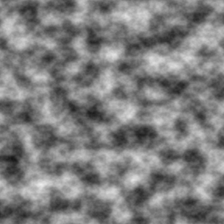

# Overview

My own implementation of Perlin Noise, mainly to be used with my Minecraft map generator. Work-in-progress, but basic functionality is working.

# Dependencies

* Python pillow (PIL) for image generation
* numpy for an assert that checks if generated unitary vector does in fact have a length of 1

# Usage

First step is to create an object of the Perlin class. It's constructor has the following parameters:

* GRID_HEIGHT - how high vector grid is (the amount of vectors is GRID_HEIGHT + 1)
* GRID_WIDTH
* OCTAVES - how many octaves of fractal noise to generate
* DAMP - every following octave is multiplied by a power of this parameter, the "opacity" of each layer

There are two other set-up methods:

* setCellSize(cell_size: int) - how many pixels are there in each cell of the grid
* generateVectorGrid() - creates random unitary vectors for each node on the grid
* rotateVectors(angle, a, b) - rotates all vectors in the grid by angle. a and b are coefficients used to randomly pick the direction for each vector (to make them all rotate clockwise use a=0 and b=0)

When the required set-up steps are completed, Perlin object offers the following methods:

* perlinValue(x: int, y: int) returns the noise value for the pair of values (x, y) including all octave layers. Returns float in the range of [-1; 1]
* toImage() - creates an image of size GRID_SIZE * CELL_SIZE using the perlinValue method. Returns a PIL Image in "L" color mode.
* animatedGif(frame_amount: int, duration: int, random_directions: bool) - saves an animated gif of perlin noise by rotating the gradient vectors. random_directions makes vectors randomly choose the rotation direction between clockwise and counter-clockwise (default true). each frame vectors rotate by the angle of 2pi/frame_amount
* stepByStep() - creates an image for every octave added; Broken as of now

# Examples

# Known bugs / To-Do

* [x]  grid can only be a square for now
* [ ]  a way to sepparately get the value of each octave layer
* [ ]  a way to map the noise result to a veratin range, to create region maps
* [ ]  stepByStep is broken
* [ ]  hide some of the functions
* [ ]  more ways to create partial images
* [ ]  reimplement a way to draw vectors used to create the noise
